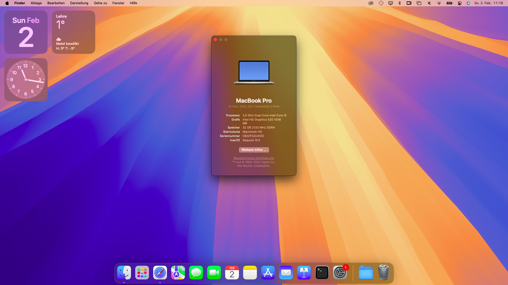

# HP EliteBook 840 G3 EFI  

## Opencore EFI folder for HP ELiteBook 840 G3  

macOS Sequoia 15.0 final beta
   
   
**Warnings:**  

This might not work for your computer. Please check compatibility with your laptop using my specifications listed below. No garuantee. If you seek support, please DM me on [Reddit](https://reddit.com/u/randomappleboix)  

**What works and what doesn´t**

 - Working:
     - Trackpad
     - Keyboard
     - Bloetooth
     - Speaker
     - Display port
     - SD card reader
     - Most other ports (unable to test: big card reader, SIM slot)
     - Basically everything else

 - Not working:
     - Wifi, only with heliport (so no AirDrop unfortunately)
     - Display out via Dock (USB via Dock works)
     - yet to be dicovered
   
**Specs**

 - HP EliteBook 840 G3  
 - Intel Core i5 6300U  
 - Intel HD Graphics 520  
 - Synaptics touchpad  
 - 1080p LCD 14" (no touch)  
 - Intel AC 8260 Wireless card
 - 500GB Samsung SATA SSD

**EFI**

 - Opencore 1.0.1
 - All kext (at least all important ones) should have been update to the latest.
 - If you have more time than me and want to further improve this project, feel free to do so. Also, you can DM me your edit or recommendations and I will publish the changes on this repository.
 - I don´t have all that much time, but I will try to always keep this updated.

**Other important stuff**

 - You will have to modify you bios settings, please refer to [Dortania´s Guide](https://dortania.github.io/OpenCore-Install-Guide/config-laptop.plist/skylake.html#intel-bios-settings) for that.
 - You will also have to install macOS to a USB, refer to [this part of Dortania´s guide](https://dortania.github.io/OpenCore-Install-Guide/installer-guide/windows-install.html) for that.
 - When troubleshooting, refer to [Dortania´s troubleshooting section](https://dortania.github.io/OpenCore-Install-Guide/troubleshooting/troubleshooting.html) or to the [Hackintosh subreddit](https://reddit.com/r/hackintosh)
 - Wifi doesn´t work and never will natively, you have to use ethernet for the installation, then download [Heliport](https://github.com/OpenIntelWireless/HeliPort/releases/tag/v1.5.0) and add it to the login applications.
 - Tested on Sonoma 14.4.1 and 15.0 final beta.
 - When using a NVMe drive you might have to manually add [NVMefix.kext](https://github.com/acidanthera/NVMeFix/releases)

**Legacy Screenshots:**

macOS Sonoma 14.4.1

